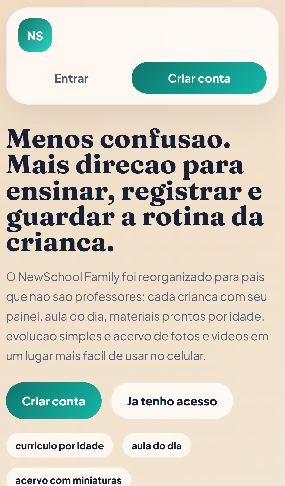
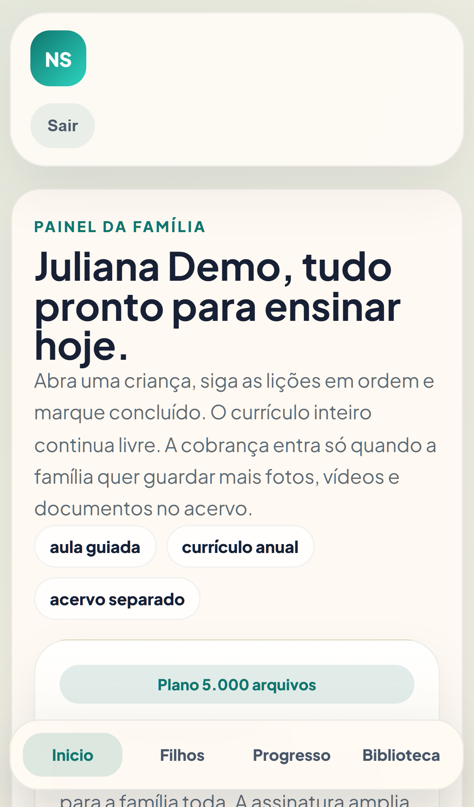
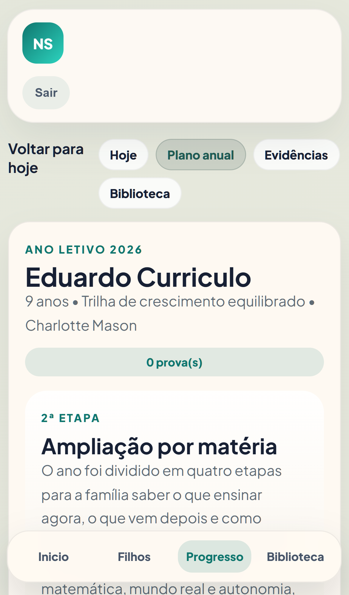
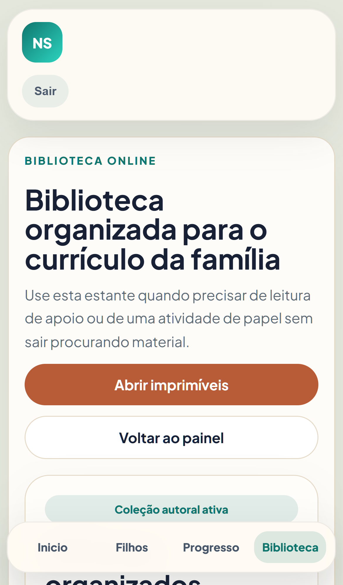
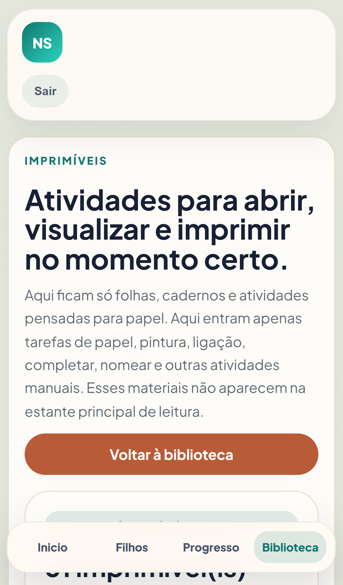
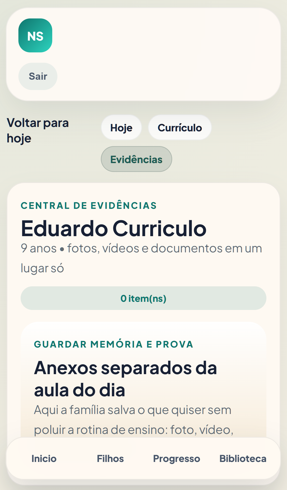

# NewSchool Family

NewSchool Family is a mobile-first platform for **ensino domiciliar**. It helps families organize the daily routine, follow an annual curriculum, guide lessons step by step, and preserve evidence of learning in a separate media archive.

The current repository contains the web application used to run the parent experience, daily lessons, curriculum sequencing, reading flow, printable recommendations, billing, and evidence management.

## Product highlights

- Guided daily lessons with a clear `faça agora` flow
- Annual curriculum organized by age range and subject
- Weekly and monthly progression without forcing families to build plans manually
- Reading routine tied to curriculum stages
- Separate evidence center for photos, videos, and documents
- Storage plans with Stripe-based billing
- Public pages ready for SEO and future advertising slots

## How the platform works

The product is organized around one simple parent flow:

1. The family lands on a public mobile-first home page and creates an account or signs in.
2. The parent opens the family dashboard and chooses which child should study now.
3. The child page promotes one guided lesson at a time, with the next lesson already queued.
4. The annual curriculum shows what belongs to the current stage of the year and what comes next.
5. The library separates reading material from printables so the parent does not have to search outside the platform.
6. The evidence center stores photos, videos, and documents without mixing uploads into the teaching routine.

## Product walkthrough

The screenshots below were captured from the local application running at `http://localhost:5000` in a mobile viewport.

### 1. Public home



The public entry point explains the value proposition immediately: a simpler routine for `ensino domiciliar`, daily lessons, age-based curriculum, and a separate archive for records.

### 2. Family dashboard



After sign-in, the parent lands on a compact dashboard focused on action. The main screen highlights the family plan, children area, progress area, and library without forcing deep navigation first.

### 3. Guided lesson for today


The child page is the operational center of the day. It surfaces the active lesson, the current unit, the next step in the sequence, and direct access to curriculum, library, and evidence flows.

### 4. Annual curriculum



The curriculum view organizes the year into stages and subjects so the parent can understand what is being taught now, what belongs to the current stage, and how the progression is structured.

### 5. Library



The main library is organized as a curriculum companion. It concentrates books and support material without turning the daily lesson screen into a content dump.

### 6. Printables



Printables live in their own surface. This keeps paper activities, worksheets, and manual tasks separate from digital reading content.

### 7. Evidence center



The evidence center is dedicated to memory and proof storage. Photos, videos, and documents are attached here so the teaching flow stays clean while the family still keeps a usable record.

## Technology stack

- .NET 8
- ASP.NET Core MVC
- Entity Framework Core 8
- SQL Server
- Stripe.NET
- Resend

## Solution layout

```text
NewSchool.sln
└── NewSchool.Web
    ├── Controllers
    ├── Data
    ├── Domain
    ├── Models
    ├── Services
    ├── ViewComponents
    ├── Views
    └── wwwroot
```

This repository is intentionally organized as a **modular monolith**. The application keeps domain-oriented services, persistence, web controllers, and views inside a single deployable project so the product can evolve fast without losing code boundaries.

Additional technical notes:

- [Architecture](docs/architecture.md)
- [Deployment notes](docs/deployment.md)
- [Security policy](SECURITY.md)

## Getting started

### Prerequisites

- .NET SDK 8.0.x
- SQL Server or LocalDB

### 1. Restore dependencies

```bash
dotnet restore NewSchool.sln
```

### 2. Configure local settings

Copy the example file and adjust only what you need:

```bash
cp NewSchool.Web/appsettings.Local.example.json NewSchool.Web/appsettings.Local.json
```

You can also use **User Secrets** during development:

```bash
dotnet user-secrets --project NewSchool.Web set "NewSchool:SqlConnectionString" "Server=(localdb)\\MSSQLLocalDB;Database=NewSchoolDev;Trusted_Connection=True;TrustServerCertificate=True;MultipleActiveResultSets=True;"
```

If you prefer environment variables, the application also supports a dedicated variable that does not collide with other projects:

```bash
NEWSCHOOL_SQLSERVER_CONNECTION_STRING="Server=(localdb)\\MSSQLLocalDB;Database=NewSchoolDev;Trusted_Connection=True;TrustServerCertificate=True;MultipleActiveResultSets=True;"
```

Recommended local keys:

- `NewSchool:SqlConnectionString`
- `ConnectionStrings:StarkaidSchoolConnection`
- `Stripe:PublishableKey`
- `Stripe:SecretKey`
- `Stripe:PriceId20`
- `Stripe:PriceId80`
- `Stripe:PriceId120`
- `Stripe:PriceIdExtra100`
- `Stripe:WebhookSecretSnapshot`
- `Stripe:WebhookSecretMin`
- `Email:ResendApiKey`
- `OpenRouter:PrimaryApiKey`

### 3. Run the application

```bash
dotnet run --project NewSchool.Web
```

### 4. Build in Release

```bash
dotnet build NewSchool.sln -c Release
```

### Development demo account

When the application starts in `Development`, the seed creates a local demo parent account:

- Email: `parent@newschool.local`
- Password: `Parent123!`

The seed also creates an initial child profile so the guided lesson, curriculum, library, and evidence flows can be inspected immediately after sign-in.

## Configuration model

Versioned configuration files in this repository are **sanitized**. Real secrets must be provided through:

- `appsettings.Local.json`
- `appsettings.{Environment}.Local.json`
- User Secrets
- environment variables in deployment

## Billing and media storage

The product supports a free tier with a limited number of stored evidence files and paid tiers for larger media archives. Billing integration is implemented through Stripe and depends on environment-specific keys and webhook secrets.

## Quality and maintenance

- Release builds are validated through CI
- Local override files are ignored
- Runtime logs, generated email files, local SQLite artifacts, and publish scratch files are ignored

## Security

Do not commit secrets, production webhooks, live payment keys, or private customer data. See [SECURITY.md](SECURITY.md) for disclosure and handling guidelines.

## Contact

For product or security contact:

- `starkaid24@gmail.com`
